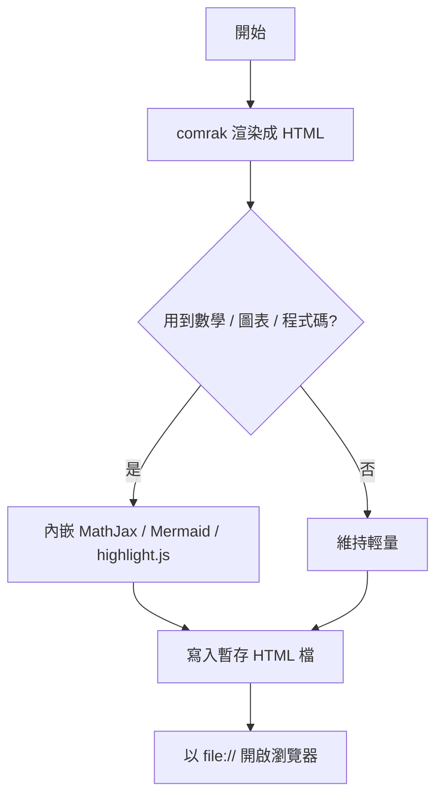
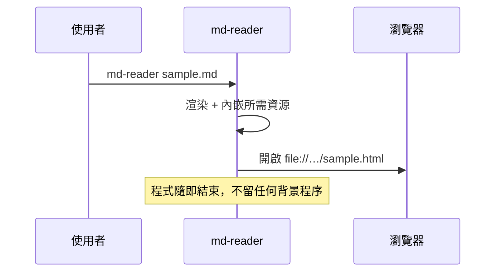

# md-reader 功能展示

這份文件涵蓋 md-reader 支援的所有語法。

## 基本語法

**粗體**、*斜體*、~~刪除線~~、__底線__、`inline code`、H~2~O 下標寫法用 HTML：H<sub>2</sub>O，上標 x^2^。

> 引用區塊
> 可以多行

分隔線：

---

## LaTeX 數學（MathJax）

行內數學：質能等價 $E = mc^2$，以及 $\alpha + \beta = \gamma$。

區塊數學：

$$
\int_{-\infty}^{\infty} e^{-x^2} \, dx = \sqrt{\pi}
$$

矩陣與對齊環境：

$$
\begin{pmatrix} a & b \\ c & d \end{pmatrix}
\begin{pmatrix} x \\ y \end{pmatrix}
=
\begin{pmatrix} ax + by \\ cx + dy \end{pmatrix}
$$

$$
\begin{aligned}
\nabla \cdot \mathbf{E} &= \frac{\rho}{\varepsilon_0} \\
\nabla \times \mathbf{B} &= \mu_0 \mathbf{J} + \mu_0 \varepsilon_0 \frac{\partial \mathbf{E}}{\partial t}
\end{aligned}
$$

## Mermaid 圖表





## 程式碼高亮

```rust
fn main() {
    let nums: Vec<u64> = (1..=10).collect();
    let sum: u64 = nums.iter().sum();
    println!("sum = {sum}");
}
```

```python
def fib(n: int) -> int:
    a, b = 0, 1
    for _ in range(n):
        a, b = b, a + b
    return a
```

## 表格

| 功能 | 引擎 | 位置 |
|------|:----:|-----:|
| Markdown 解析 | comrak | Rust |
| 數學 | MathJax 3 | 瀏覽器 |
| 圖表 | Mermaid 11 | 瀏覽器 |
| 高亮 | highlight.js | 瀏覽器 |

## 任務清單

- [x] GFM 表格
- [x] LaTeX / MathJax
- [x] Mermaid
- [ ] 收工休息

## 警示區塊（GitHub Alerts）

> [!NOTE]
> 這是一般說明。

> [!TIP]
> 圖片等相對路徑資源會自動改寫成絕對 `file://` 連結，放在哪裡都能正確載入。

> [!WARNING]
> MathJax、Mermaid 與 highlight.js 都打包在 binary 裡，完全離線可用。

> [!CAUTION]
> 產出的 HTML 放在系統暫存目錄；重開同一份文件會覆蓋舊的渲染結果。

## 註腳與定義清單

這句話有個註腳[^1]。

[^1]: 註腳內容會出現在文件底部。

comrak
: 這個閱讀器使用的 Rust Markdown 引擎。

MathJax
: 在瀏覽器端渲染 LaTeX 的引擎。

## Emoji 與自動連結

Emoji shortcode：:rocket: :crab: :tada:

自動連結：https://www.rust-lang.org

## 內嵌 HTML

<details>
<summary>點我展開（HTML <code>details</code> 標籤）</summary>

裡面一樣可以放 **Markdown 渲染後的 HTML** 與數學 $e^{i\pi} + 1 = 0$。

</details>

<kbd>Cmd</kbd> + <kbd>R</kbd> 重新整理。
